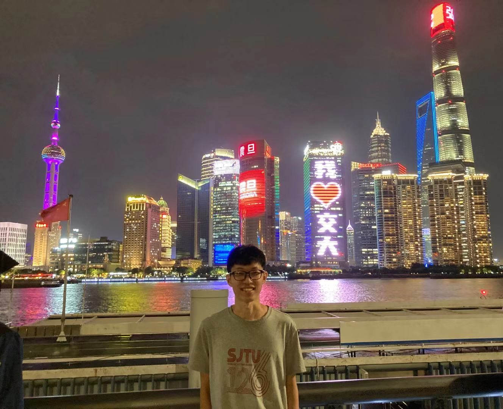

I'm Junping Li, MS and RA in Marine Science at Nezha Lab, Shanghai Jiao Tong University, and BE in Automation (EECS) at Ocean University of China. I used to study cybernetics of hybrid aerial underwater vehicle (HAUV) at Nezha Lab, Shanghai Jiao Tong University, advised by Prof. Zheng Zeng. During my university years, I was awarded: Outstanding Student, Outstanding Graduate, Study First Class Scholarship, and Practice Scholarship; I participated in Internet plus Innovation and Entrepreneurship Competition and Provincial University Robot Competition, and won the outstanding prize awards.

My background covers cybernetics, system and control theory, machine learning, vehicle dicision planning, system identification, I learn and enjoy learning knowledge, causal inference, from CNN/RNN to transformer to multimodal to what, game theory and others. Due to cybernetics, I am very interested in cognitive science and psychology, such as in language, causality, society and communication, and hope to combine cybernetics, AI and psychology to propose novel ideas, frameworks and theories, and make the contributions to the world we live in.

  

### Research Experiences

**Nonlinear Control and Deep Reinforcement Learning of HAUV** 

***J Li**, H Zhou, D Lu, et al. Nonlinear and reinforcement learning control for motion of hybrid aerial underwater vehicle. Neural Computing and Applications, 2024.* 

3-D space motion model; Key issues: disturbance and uncertainty, cross medium, control constraint; Nonlinear control including robustness, adaptation and fuzzy logic; Deep reinforcement learning of HAUV by deterministic policy, neural networks and temporal difference learning

**HAUV Cross Domain Strategy, Factors and Conditions**

***J Li**, Y Jin, R Hu, et al. Trajectory tracking control of fixed-wing hybrid aerial underwater vehicle subject to wind and wave disturbances. Journal of Intelligent & Robotic Systems, 2024.* 

Cross domain strategy to address the convergence problem of HAUV control caused by the large change in the medium transition; Key factors and conditions of the cross medium; Critical relations and feasible domains of the factors that HAUV under control schemes must meet

**Phenomena and Mechanisms of HAUV with Experiments and Neural Networks**

*T Wei, **J Li**, Z Zeng, et al. Trans-media resistance investigation of hybrid aerial underwater vehicle base on hydrodynamic experiments and machine learning. Ocean Engineering, 2022.*

Invention patent CN202110217870.4; HAUV experiments with various physics variables; Key mechanism of HAUV with multivariate analysis by neural networks

