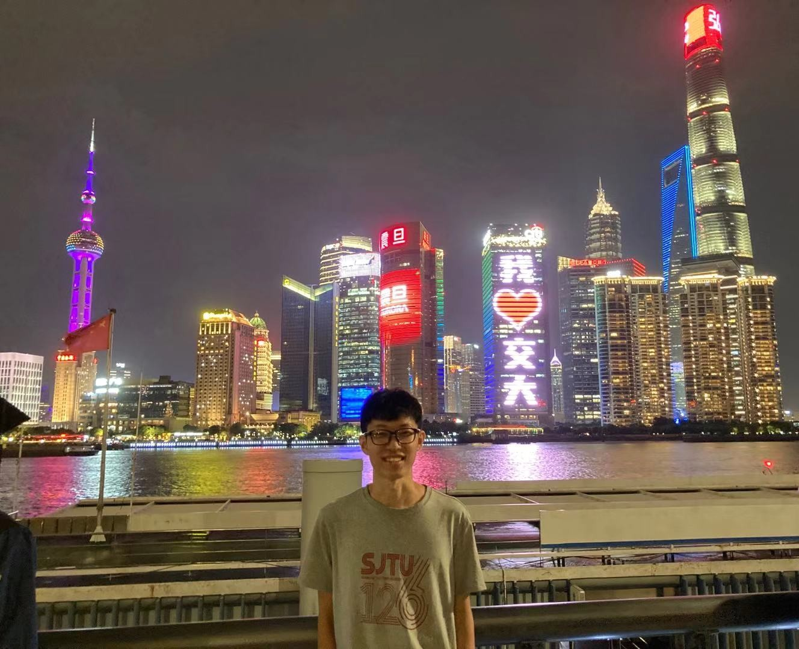

---

title: About

---

I'm Junping Li, MS in Marine Science at Shanghai Jiao Tong University and BE in Automation (EECS) at Ocean University of China. I study large model and applications at AI Institute, Shanghai Jiao Tong University, prior to this, I studied control & deep learning of cross environment vehicle, such as factor, condition, control strategy and deep reinforcement learning, at Shanghai Jiao Tong University. During my university years, I was awarded Outstanding Student, Outstanding Graduate, Academic Excellence Scholarship and Practice Scholarship.

My research covers model training, inference, agent and applications, such as interaction of multiple models in space, mapping nonlinearity of modal space, and social simulation of agent or model space with cognition friction or other social factors. I have been learning and enjoy acquiring new knowledge, such as AI trend, linguistics, causal inference, cognitive science, game theory and so on, also interested in mind, cognition, language and society, sometimes thinking something interesting: human non Bayesian or non scientific cognition but enough natural/effective, fuzzy learning that we in most cases are based on rules and fuzzy logic, with explainable expression and network compatibility. In the project and research questions, I hope to combine AI, psychology, linguistics and multiple disciplines to propose new ideas, theories and works, and make contributions to the development of human and society and the world we live in.

  

### Projects & Publications

**Mapping Nonlinearity of Language and Modal Space with Large Model**

*AI Institute, Shanghai Jiao Tong University, 2025*

Designed a modal space network, built, trained, and tuned the model based on LLaMA and transformers by RMS norm, KV cache and grouped query attention; Modal space alignment training with nonlinear mapping and fine tuning based on Qwen and SigLIP; Comparison of training effects about multiple mappings.

**Project Large Model Know System Engineering**

Machine learning and deep learning fundamental, Transformer, language model, Training, Fine-tuning and RL, Inference, Large model advance, Multi modal, Agent, Field application

**Nonlinear Control and Deep Reinforcement Learning of Cross Environment Vehicle**

***Junping Li**, H Zhou, D Lu, et al. Nonlinear and reinforcement learning control for motion of hybrid aerial underwater vehicle. Neural Computing and Applications, 2025.*

Proposed a 3-D space cross model; Key issues: uncertainty, cross environment(CE), constraint of environment difference; Nonlinear control laws with robustness, adaptation and fuzzy logic; Deep reinforcement learning of CE vehicle by deterministic policy, neural networks and temporal difference learning; Various methods in the tracking cases of issues.

**Cross Domain Strategy, Factors and Conditions**

***Junping Li**, Y Jin, R Hu, et al. Trajectory tracking control of hybrid aerial underwater vehicle subject to wind and wave disturbances. Journal of Intelligent & Robotic Systems, 2024.*

Proposed a strategy to address the control convergence problem caused by the large change of environment transition; Key factors and conditions of the cross environment in the various scenarios with multiple variables; Critical relations and feasible domains of the factors that control conditions need to meet.

### Skills

C/C++, Matlab & Simulink, Python, LaTeX, PyTorch, TensorBoard, OpenBayes, drawio, Transformers, Datasets, Pre-training, Continued training, MoE, SFT/instruct fine-tuning, PEFT, LoRA, unsloth, llama-factory, RLHF/AIF, DPO, PPO, GRPO, trl, API, function call, prompt engineering, RAG, llamaindex, milvus, RAGFlow, Agent, CoT, ReAct, Reflection, MCP, langchain/langgraph, Multi modal, CLIP, LLaVA, Distributed parallel, Accelerate, Deepspeed, FastAPI, vllm, Quantization, Distillation

### Academic Services

Neural Computing and Applications, ICRA, IROS

### Contact
Email: ljp.id [at] sjtu.edu.cn  
Web: junpingli.com  
Address: Shanghai Jiao Tong University, 800 Dongchuan Road, Shanghai 200240

<!--

-->

<!--

-->

