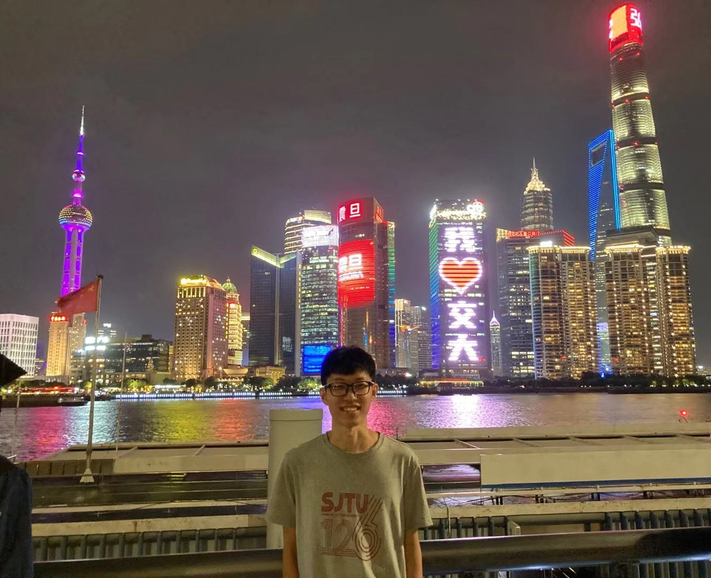

---

title: About

---

I'm Junping Li, MS in Marine Science at Shanghai Jiao Tong University, and BE in Automation (EECS) at Ocean University of China. I used to study cybernetics of cross environment vehicle (CEV) or hybrid aerial underwater vehicle (HAUV) at Shanghai Jiao Tong University, advised by Prof. Zheng Zeng. During my university years, I was awarded: Outstanding Student, Outstanding Graduate, Study First Class Scholarship, and Practice Scholarship; I participated in Internet plus Innovation and Entrepreneurship Competition and Provincial University Robot Competition, and won the outstanding prize awards.

My background covers cybernetics, system and control theory, machine learning, vehicle dicision planning, robotics, and system identification, I learn and enjoy learning new knowledge, causal inference, from CNN/RNN to transformer to multimodal to what, game theory or others. Due to cybernetics and the development of language models, I develop very interested in cognition or psychology, such as in mind, language, causality, behavior, society or communication, and hope to combine cybernetics, AI and psychology to propose novel ideas and theories, and they can be applied to the development of human, society and robotic systems, and make contributions to the world we live in.

  

### Research Experiences

**Nonlinear Control and Deep Reinforcement Learning of CEV/HAUV** 

***Junping Li**, H Zhou, D Lu, et al. Nonlinear and reinforcement learning control for motion of hybrid aerial underwater vehicle. Neural Computing and Applications, 2024.*

3-D space motion model; Key issues: disturbance and uncertainty, cross environment, control constraint; Nonlinear control including robustness, adaptation and fuzzy logic; Deep reinforcement learning of CEV/HAUV by deterministic policy, neural networks and temporal difference learning

**CEV/HAUV Cross Domain Strategy, Factors and Conditions**

***Junping Li**, Y Jin, R Hu, et al. Trajectory tracking control of fixed-wing hybrid aerial underwater vehicle subject to wind and wave disturbances. Journal of Intelligent & Robotic Systems, 2024.*

Cross domain strategy to address the convergence problem of CEV/HAUV control caused by the large change in the environment transition; Key factors and conditions of the cross environment; Critical relations and feasible domains of the factors that CEV/HAUV motion or control conditions must meet

**Phenomena and Mechanisms of CEV/HAUV with Experiments and Neural Networks**

*T Wei, **Junping Li**, Z Zeng, et al. Trans-media resistance investigation of hybrid aerial underwater vehicle base on hydrodynamic experiments and machine learning. Ocean Engineering, 2022.*

Invention patent CN202110217870.4; Cross environment experiments of CEV/HAUV with various motion states; Key mechanism of CEV/HAUV with multivariate analysis by neural networks

#### Academic Services

Neural Computing and Applications, ICRA, IROS

### Contact
Email: ljp.id [at] sjtu.edu.cn  
Web: junpingli.com  
Address: Shanghai Jiao Tong University, 800 Dongchuan Road, Shanghai 200240

<!--

-->

<!--

-->

